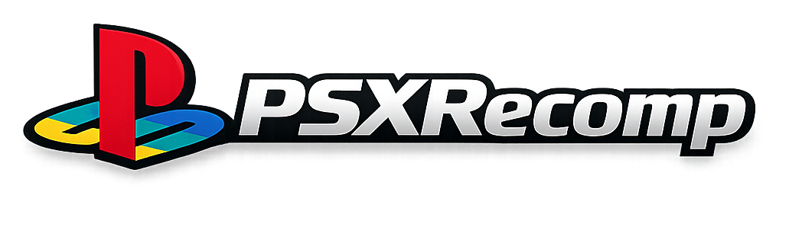

<p align="center">
  
</p>

# PSXRecomp

Generic static recompiler framework for PlayStation 1: MIPS R3000A to C to
native x64.

Background on the original prototype:
[I Built a PS1 Static Recompiler With No Prior Experience (and Claude Code)](https://1379.tech/i-built-a-ps1-static-recompiler-with-no-prior-experience-and-claude-code/)

[](https://www.youtube.com/watch?v=CID9oVhgCyY)

## What It Is

PSXRecomp translates PS1 MIPS binaries into C, then compiles that C as a
native executable linked against a PS1 hardware runtime. The v4 architecture
recompiles the real SCPH1001 BIOS and runs it as the kernel. There is no HLE
BIOS layer, no stubs, and no general-purpose interpreter fallback for static
code.

PSXRecomp is a framework. Game-specific projects live in their own
repositories and pull this one in to build a game binary. The active end-to-end
target is [TombaRecomp](https://github.com/mstan/TombaRecomp).

## Philosophy — toward 100% static recompilation

The goal is simple and absolute: **a PS1 game should run as native code, not be
emulated.** Every MIPS instruction the game executes should ideally have been
translated to C and compiled ahead of time. No interpreter on the hot path, no
HLE shims, no "good enough" approximation of the hardware — the recompiled BIOS
*is* the kernel, and the recompiled game *is* the game.

PS1 games make that goal hard in one specific way: **overlays.** Games stream
code off the disc into RAM at runtime and execute it, then overwrite it with the
next overlay. That code does not exist in the executable at build time, so a
pure ahead-of-time recompiler cannot see it. This is the frontier the project is
working through, and it is why this is an **alpha/beta**: today a *majority* of a
supported game runs as statically recompiled native code, but **not yet 100%.**

How we close the gap, without ever compromising correctness:

1. **Static first.** The main executable and the BIOS are fully recompiled
   ahead of time. This is the bulk of execution and it is always native.
2. **Capture → compile → cache for overlays.** As the game runs, overlays are
   captured the moment they load. Offline, each is recompiled to a native DLL
   keyed by its content, cached, and on later runs loaded and dispatched as
   native code *before* any fallback. Coverage grows as the game is played:
   every overlay someone reaches becomes native for everyone after.
3. **Interpreter failover — only for code that isn't static yet.** A small
   MIPS interpreter runs *runtime-installed* code (overlays/dirty RAM) that
   hasn't been captured-and-compiled. It is a safety net and a coverage feeder,
   never a substitute for recompiling static code, and never on the BIOS/main-EXE
   path.
4. **Precision over recall.** A piece of code we *haven't* compiled safely falls
   back to the interpreter and gets captured for next time — under-coverage
   self-heals. A piece we compile *wrong* would corrupt the machine, so the
   system biases hard toward correctness: native code is only dispatched when its
   source RAM is provably unchanged, and a registration is revoked the instant
   the RAM it was compiled from is overwritten.

Two honest bounds. **The worst case is always performance, never correctness** —
anything not yet native simply runs interpreted, correctly.

**Known corner case — genuinely self-modifying / per-load-relocated code.** Some
code is rewritten or relocated to *different bytes on every load*, so it is not
static by definition and cannot be recompiled ahead of time into a single
correct translation. **This code remains interpreted** — permanently, as far as
the current design is concerned, and that is an accepted, correct outcome (the
interpreter runs it faithfully; only speed is lost). It is a narrow corner, not
a wall. We **may someday aim to cover it** — e.g. by detecting the
relocation/patch pattern and baking it in at compile time (keyed by relocation
parameters), or by compiling at load time — but we make no promise, and the
project is fully correct without it.

The aspiration is **100% static coverage** — every reachable instruction native,
the interpreter idle. The capture-and-recompile loop converges toward it the more
a game is played; this branch is where that machinery is being built.

## Status

Current milestone as of 2026-05-18:

| Subsystem | State |
|---|---|
| BIOS recompilation (`SCPH1001.BIN`) | Boots and hands off to Tomba |
| Game EXE recompilation | Tomba title, OPTIONS, NEW GAME, save/load, and gameplay reached |
| CD-ROM / MDEC / XA | Tomba FMVs stream and play at the game's 15 fps cadence |
| Memory cards | Tomba save and load verified |
| SIO0 controllers | Digital pad polling plus DualShock config replies used by Tomba |
| GPU | Functional for BIOS boot, FMVs, menus, and first gameplay area |
| Interrupts, COP0, timers | Working for current Tomba path |
| Dirty-RAM support | BIOS/game RAM-installed dispatch paths handled |
| Controller input | Keyboard plus SDL/XInput-style controller mapping via `input.ini` |

Known follow-up work:

- The recent Tomba visual burn-down fixed the BIOS PS logo, title/menu glyph
  seams, dialog/pause panel seams, terrain shading, and shaded textured branch
  rendering observed in the first area.
- SPU coverage is partial; reverb, noise, sweep, and accurate SPU IRQ behavior
  are not complete.
- The historical Windows "Not Responding" hang is mitigated but should stay on
  the watch list until longer in-game soak tests are clean.
- Tomba is the only current game target validated end to end.

For the current game milestone, build and run the sibling TombaRecomp project:

```sh
cd F:/Projects/TombaRecomp
cmake --build build -j16
./build/psx-runtime.exe --game game.toml
```

Running this repository's runtime without `--game` is still useful for
BIOS-only memory card management.

## Release Package

The framework release package is BIOS-only:

1. Download `PSXRecomp-v*-windows-x64.zip` from Releases.
2. Extract it and run `PSXRecomp.exe`.
3. Select your legally obtained `SCPH1001.BIN` BIOS when prompted.

The package does not include a PS1 BIOS, game disc image, generated game code,
or save data. The selected BIOS path is saved next to the executable as
`bios.cfg`; delete that file to pick a different BIOS later.

Game-specific recomp projects, including TombaRecomp, use the same runtime
picker contract but also prompt for a legally obtained game disc image.

## Setup

Builds natively on **Windows (MSVC/MinGW)**, **macOS (Apple Silicon & Intel)**,
and **Linux**. The BIOS thread scheduler uses host fibers — Win32 Fibers on
Windows, `ucontext` on POSIX (`runtime/src/psx_fiber.c`) — so the recompiled
BIOS's cooperative thread switching (the CD-boot handoff in particular) behaves
the same on every platform.

Requirements:

- A C/C++ toolchain: MSVC or MinGW (Windows), Apple Clang (macOS), Clang/GCC (Linux).
- CMake 3.20+. On macOS/Linux also `ninja` and `pkg-config`.
- SDL2: the bundled dev pack on Windows; `brew install sdl2 pkg-config ninja`
  on macOS; `libsdl2-dev` (or distro equivalent) on Linux.
- A legally obtained `SCPH1001.BIN` BIOS dump. Not included.
- For game projects, a legally obtained game disc/EXE dump. Not included.

Build the framework runtime:

```sh
# Windows (MSYS2/MinGW)
cmake -S recompiler -B recompiler/build -G "Unix Makefiles" && cmake --build recompiler/build
cmake -S runtime    -B runtime/build    -G "Unix Makefiles" && cmake --build runtime/build --target psx-runtime

# macOS / Linux (Ninja)
cmake -S recompiler -B recompiler/build -G Ninja -DCMAKE_BUILD_TYPE=Release && ninja -C recompiler/build
cmake -S runtime    -B runtime/build    -G Ninja -DCMAKE_BUILD_TYPE=Release && ninja -C runtime/build psx-runtime
```

Game projects generate their own `generated/<serial>_*.c` files and link this
runtime source tree through CMake.

## Keyboard Map

| PSX button | Keyboard |
|---|---|
| D-Pad Up / Down / Left / Right | Arrow keys |
| Cross | X |
| Square | Z |
| Circle | S |
| Triangle | A |
| L1 / R1 | Q / W |
| L2 / R2 | E / R |
| Start | Enter |
| Select | Right Shift |
| Turbo | Tab (hold) |
| Fullscreen | F11 / Alt+Enter / Cmd+F |

## Controller Map

Xbox-style controller defaults are enabled when a controller is connected:

| PSX button | Xbox controller |
|---|---|
| D-Pad Up / Down / Left / Right | D-pad or left stick |
| Cross | A |
| Circle | B |
| Square | X |
| Triangle | Y |
| L1 / R1 | LB / RB |
| L2 / R2 | LT / RT |
| Start | Menu |
| Select | View / Back |

Release builds create/use `input.ini` next to the executable. Edit that file to
change controller device index, deadzone, or button mapping.

## Architecture

The recompiler emits C functions and dispatch tables for BIOS and game code.
The runtime loads the BIOS/game assets into emulated PS1 memory, links the
generated C as native code, and simulates hardware through MMIO handlers for
GPU, DMA, timers, CD-ROM, MDEC, SIO0, memory cards, SPU, GTE, and interrupt
delivery. BIOS A0/B0/C0 vectors go through the recompiled BIOS, not HLE shims.

See `CLAUDE.md`, `PLAN.md`, and `CURRENT_STATE.md` for the development rules
and current project context.

## Disc Speed

Per-game `disc_speed` in `game.toml [runtime]` compresses CD-ROM timing:

| Value | Effect |
|---|---|
| `"1x"` | Authentic PSX timing. Default for all games. |
| `"2x"` / `"4x"` | 2× / 4× faster reads and seeks. |
| `"instant"` | Minimum-floor delays. **Known to hang some games** during early initialization; root cause not yet identified. Use `"4x"` instead until resolved. |

FMV playback is always protected: the CD-ROM layer reverts to 1× whenever XA
audio streaming is active, regardless of `disc_speed`. The speed switch fires
only after the BIOS has handed off to the game EXE — boot and the license
screen always run at authentic 1×.

## Help make your game faster — just by playing it

**Why isn't the game already at full speed everywhere?** Most of a game's
code is converted ("recompiled") into a fast native program ahead of time.
But PlayStation games don't keep all of their code on screen at once — they
stream extra chunks of code off the disc as you reach new areas (these
chunks are called *overlays*). We can't convert a chunk we've never seen,
and the only way to see it is for someone to actually visit that area.
Until then, that area's code runs in a slower compatibility mode.

**You can help, just by playing.** While you play, the game quietly notices
which areas are still running in the slow mode, takes a snapshot of them,
and converts them to fast native code in the background — often within a
minute, while you keep playing. The more places you visit, the faster the
game gets. This happens automatically; you don't have to do anything.

**Make your discoveries permanent for everyone.** Your discoveries are saved
in a small file written next to the game called `overlay_captures.json`.
After a play session — especially if you visited areas nobody has explored
yet — open a GitHub issue on the game's repository and attach that file.
The project maintainer will work to fold your discoveries back into the
project, and every player gets your areas at full speed from the first
moment they arrive. No technical knowledge needed: play, find the file,
attach it to an issue.

What's safe to know:
- The file contains only game code snapshots and addresses — no personal
  data, no save files, no settings.
- Sharing is optional. Your own copy still benefits either way.
- Re-visiting an area someone already contributed is harmless — duplicates
  are detected and skipped automatically.

## License

PolyForm Noncommercial 1.0.0. See `LICENSE`.

The PSX BIOS and game disc images remain copyrighted by their respective
owners. This project distributes neither.
